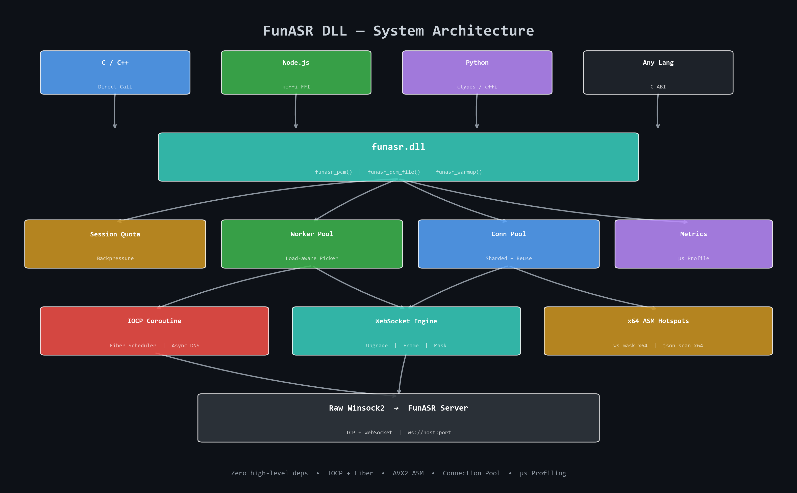
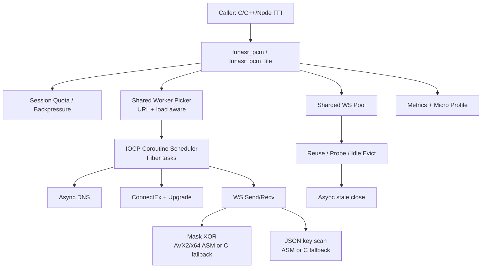
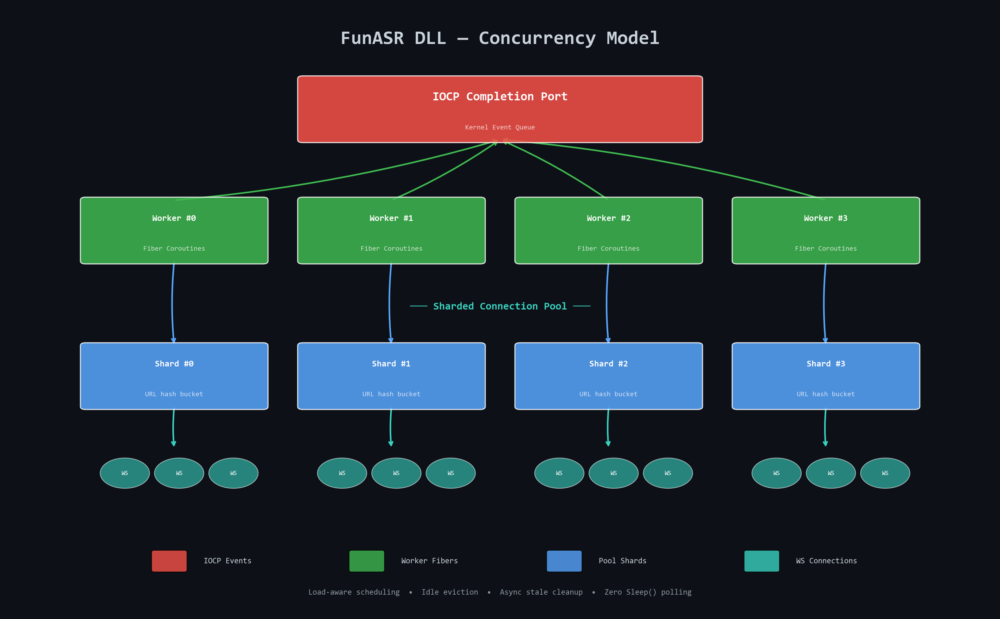
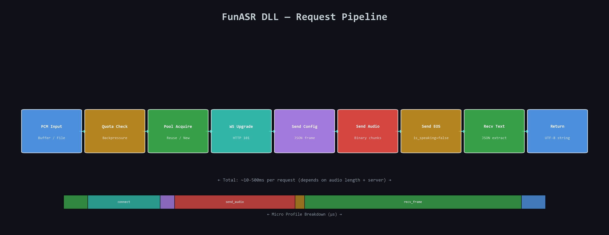

Skills_FunASR_Win32DLL - High-Concurrency FunASR C DLL (IOCP + Coroutine + x64 ASM)

 

一个面向 Windows x64 的高并发语音转写 DLL。(不是模型 给openclaw写的skills)

核心目标不是“能跑”，而是“在 C ABI 可直接调用前提下，把并发吞吐、尾延迟和 CPU 利用率做上去”。


项目当前采用 `Raw Winsock + WebSocket + IOCP + Fiber Coroutine + 连接池 + 热点汇编` 的组合路径，提供稳定 C 接口给 C/C++/Node.js FFI（如 koffi）直接调用。


---


## Why This Repo


- 面向生产并发：不是单次 demo 调用，而是持续波次并发请求。

- 面向尾延迟：关注 `P95/P99`、超时率、失败率、连接复用率。

- 面向工程可控：保留 C fallback，ASM 做特性分发，不走“盲目全汇编”。

- 面向 FFI 场景：导出 API 简洁，宿主语言接入成本低。


---


## Core Features


| 模块 | 说明 | 目标 |

|------|------|------|

| IOCP 协程主路径 | connect / upgrade / send / recv 全链路异步 | 降低线程阻塞与上下文切换 |

| 共享 worker 调度 | 多 worker 共享 IOCP 调度器池 | 扛高并发波次请求 |

| 分片连接池 | URL 哈希分片 + 池复用 | 降低重复握手开销 |

| 动态预热 | `funasr_warmup` + 自动预热策略 | 降低冷启动延迟 |

| 安全随机 masking | `BCryptGenRandom` 生成 mask / nonce | RFC 6455 合规与安全 |

| x64 ASM 热点 | WS mask XOR / JSON key scan | 降低 CPU 热点开销 |

| 细粒度指标 | metrics + micro-profile | 支撑 profile 驱动优化 |


---


## Architecture Overview





```text

Caller (C/C++/Node FFI)

    |

    v

funasr_pcm / funasr_pcm_file

    |

    +-- Session Quota / Backpressure

    |

    +-- Shared Worker Pick (load-aware)

    |       |

    |       +-- Coroutine Scheduler (Fiber)

    |               |

    |               +-- IOCP await: DNS / ConnectEx / WSASend / WSARecv

    |

    +-- Sharded WS Pool (reuse / idle expiry / async stale cleanup)

    |

    +-- WebSocket protocol path

            +-- upgrade handshake

            +-- frame masking (ASM or C fallback)

            +-- recv + text extraction

```


### Mermaid Diagram





---


## Concurrency Model





### 1) IOCP + Fiber Coroutine

- 每个共享 worker 内使用 fiber 协程调度。

- I/O 通过 IOCP completion 驱动，避免同步阻塞链路。

- await 路径支持超时与取消，异常网络下不会无限挂起。


### 2) Shared Worker Pool

- worker 数按 CPU 核心动态探测并设上下限。

- 请求按 `URL + worker 当前负载` 进行分流，避免单 worker 吞流。

- 初始化路径已重构为事件等待，去除 `Sleep(1)` 自旋等待抖动。


### 3) Sharded Connection Pool

- 连接池按分片锁组织，降低全局锁争用。

- 支持连接复用、空闲超时淘汰、死连接探活替换。

- stale 连接清理采用锁外异步关闭，降低 acquire 路径阻塞风险。


---


## Performance-Oriented Design





### Network/Data Path

- `ws_connect + HTTP upgrade` 已异步化并进入协程主路径。

- 异步 DNS 路径避免 `getaddrinfo` 阻塞业务线程。

- WS payload masking 支持 ASM dispatch（AVX2/x64）与 C fallback。


### Hotspot Strategy

- 先 profile，再替换。

- 已替换热点：

  - `ws_mask_x64.asm`：mask XOR copy/inplace

  - `json_scan_x64.asm`：JSON key 定位

- 非热点保留 C 实现，优先可维护性。


### Correctness & Safety

- WebSocket mask key / upgrade nonce 使用 CSPRNG（`BCryptGenRandom`）。

- TLS 临时缓冲在线程生命周期内有清理路径。

- 连接池 in-flight 计数和 cleanup 竞态已修复。


---


## Public C API


头文件：`src/funasr_dll.h`


```c

int         funasr_init(void);

const char* funasr_pcm(const uint8_t* pcm_data, uint32_t pcm_len, const char* ws_url);

const char* funasr_pcm_file(const char* pcm_path, const char* ws_url);

void        funasr_free(const char* ptr);

uint32_t    funasr_last_error(void);

void        funasr_get_metrics(funasr_metrics_t* out_metrics);

void        funasr_get_profile(funasr_profile_t* out_profile);

int         funasr_warmup(const char* ws_url, uint32_t target_idle);

void        funasr_cleanup(void);

```


返回字符串由 DLL 内部分配，调用方必须 `funasr_free`。


---


## Metrics & Profile


### Metrics (`funasr_metrics_t`)

- `total_requests`

- `total_success`

- `total_fail`

- `total_timeout`

- `pool_reuse_hits`

- `pool_new_connects`


### Micro Profile (`funasr_profile_t`, us)

- `us_total`

- `us_pool_acquire`

- `us_connect`

- `us_send_config`

- `us_send_audio`

- `us_send_eos`

- `us_recv_frame`

- `us_json_parse`


用于快速定位瓶颈是在网络、连接、池争用还是解析阶段。


---


## Build


### Requirements

- Windows x64

- Visual Studio 2022 Build Tools

- CMake >= 3.16


### Build Commands


```powershell

cmake -B build -G "Visual Studio 17 2022" -A x64

cmake --build build --config Release

```


### Outputs

- `build/Release/funasr.dll`

- `build/Release/funasr_test.exe`


---


## Test & Benchmark


测试程序：`src/test_main.c`


```powershell

# 单次

build\Release\funasr_test.exe <pcm_file> ws://<host>:<port>


# 波次并发（示例：32 并发 x 10 轮）

build\Release\funasr_test.exe <pcm_file> ws://<host>:<port> 32 10

```


默认输出包含：

- `QPS`

- `P95 / P99`

- `FailRate / TimeoutRate`

- `PoolReuseRate`

- Profile 分阶段均值


建议用相同音频、相同服务端、相同并发参数做 A/B 对比，避免环境抖动导致误判。


---


## Performance Evolution


以下为同一环境、同一音频、同一服务端口径下的实测样例（`32 并发 x 10 轮`）：


| 版本/改动 | WallTime | QPS | P95 | P99 | 说明 |

|-----------|---------:|----:|----:|----:|------|

| 基线（旧版） | 136328 ms | 2.35 | 10375 ms | 13687 ms | 启动期抖动和尾部延迟偏大 |

| Worker init 重构（事件等待替代自旋） | 102422 ms | 3.12 | 10359 ms | 10453 ms | P99 明显收敛，吞吐提升 |


波次抖动（每轮耗时）统计对比：


| 指标 | 重构前 | 重构后 | 变化 |

|------|-------:|-------:|-----:|

| 波次标准差 | 478.46 ms | 214.19 ms | -55% |

| 波次极差 | 1453 ms | 766 ms | -47% |


说明：网络与服务端状态会带来自然抖动，建议至少跑 3 轮取中位数做版本对比。


---


## Integration (Node.js koffi)


```js

const koffi = require('koffi');

const lib = koffi.load('funasr.dll');


const funasr_init = lib.func('funasr_init', 'int', []);

const funasr_pcm_file = lib.func('funasr_pcm_file', 'str', ['str', 'str']);

const funasr_free = lib.func('funasr_free', 'void', ['str']);

const funasr_cleanup = lib.func('funasr_cleanup', 'void', []);


funasr_init();

const res = funasr_pcm_file('a.pcm', 'ws://192.168.31.192:10090');

console.log(res);

funasr_free(res);

funasr_cleanup();

```


---


## Source Map


- Core API: `src/funasr_dll.c`, `src/funasr_dll.h`

- WS protocol / transport: `src/ws_client.c`, `src/ws_client.h`

- Coroutine scheduler: `src/iocp_coro.c`, `src/iocp_coro.h`

- ASM hotspots:

  - `src/ws_mask_x64.asm`

  - `src/json_scan_x64.asm`

- Benchmark tool: `src/test_main.c`

- Build config: `CMakeLists.txt`


---


## Optimization Principles (Project Policy)


1. 先并发稳定，再做定点极限优化。

2. 先 profile，再上汇编；无占比不替换。

3. 汇编必须保留 C fallback，按 CPU 特性分发。

4. 优先保障正确性与尾延迟，再追求峰值吞吐。


---


## License


按仓库当前约定执行（如需开源许可证请补充 `LICENSE` 文件）。


